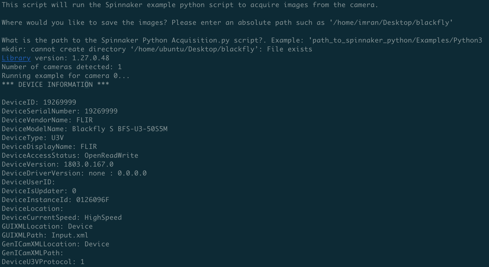
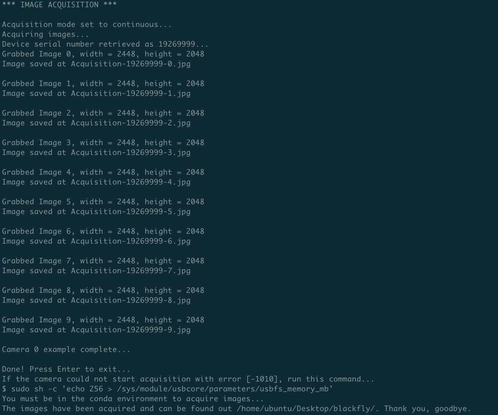

# Ubuntu Desktop 18.04 and Spinnaker SDK Installation on LattePanda Steps

This is a guide to installing Ubuntu Desktop 18.04 and Spinnaker SDK onto your LattePanda. It is meant to support
image acquisition.

## Getting Started

These instructions will get you a copy of the project up and running on your local machine for development and testing purposes. See deployment for notes on how to deploy the project on a live system.

### Prerequisites

What things you need to install the software and how to install them. These downloads can be either on your local computer
and then use SCP to transfer them onto the remote computer, or can be downloaded straight onto the remote computer.

1. Download Ubuntu Desktop 18.04.4 LTS from this [link](https://releases.ubuntu.com/18.04.4/).
3. Download the Spinnaker for AMD64 package from this [link](https://flir.app.boxcn.net/v/SpinnakerSDK). It is located at Linux->Ubuntu18.04->beta-spinnaker-2.0.0.109-Ubuntu18.04-amd64-pkg.tar.gz
4. Download the Python wrapper for Spinnaker for x86_64 package from this [link](https://flir.app.boxcn.net/v/SpinnakerSDK). It is located at Linux->Ubuntu18.04->python->x64->spinnaker_python-2.0.0.109-Ubuntu18.04-cp37-cp37m-linux_x86_64.tar.gz
5. Install BalenaEtcher from this [link](https://www.balena.io/etcher/).


### Installing Ubuntu

A step by step guide that tell you how to install Ubuntu.

1. Burn the .iso onto USB using BalenaEtcher.
2. Insert USB into LattePanda.
3. Press ESC upon boothup to enter BIOS.
4. Boot from the USB drive (usually says name).
5. Choose to install Ubuntu.
    - IMPORTANT: If the Ubuntu Desktop only shows up, then the internal display is enabled. What that means is the HDMI port and the internal display are side by side. You will have to find out which edge will allow the mouse to disappear. Then you must try to grab the installation window from the internal display and drag it onto the monitor.
7. Follow On-Screen instructions.
    - Choose: English.
    - Choose: I don’t want to connect to a wi-fi network right now.
    - Choose: Normal Installation and Download updates.
    - Choose: Erase disk and install Ubuntu.
    - Choose: Time Zone to Los Angeles.
    - Set user credentials.
    - Select login automatically.
8. Remove installation media when prompted.

8.5. If you did not select "login automatically", a purple screen will appear. You need to enter your password even though it may not show the prompt. Once the password is entered, the Desktop with an orange background and beaver will appear. Press "CTRL-ALT-T" to open a terminal. Type the command below even if you do not see the terminal because your cursor will be already inside the terminal.

9. To disable second output DSI use this command in the terminal.
```
xrandr --output DSI-1 --off
```
10. Enable SSH
```
sudo apt install openssh-server
sudo systemctl enable ssh
sudo systemctl status ssh
sudo ufw allow ssh
```
11. Login into the LattePanda from your remote computer using this command.
```
ssh [USER]@[IP_ADDRESS]
```
12. Check if the system is running other apt update processes.
```
ps aux | grep -i apt
```
13. Update and upgrade the system.
```
sudo apt update -y && sudo apt upgrade -y
```

### Installing Spinnaker

A step by step guide that tell you how to install Spinnaker.

1. Install necessary libraries.
```
sudo apt install git curl vim -y
```
2. Clone the required repository.
```
cd ~/Desktop
git clone https://github.com/imranmatin23/LattePanda-Ubuntu18.04-Spinnaker-Installation.git
```
3. Install Anaconda and exit the shell.
```
sh install_anaconda.sh && exit
```
4. Login on your remote computer.
```
ssh -X [USER]@[IP_ADDRESS]
```
5. Create Spinnaker Python environment.
```
sh create_spinnaker_env.sh
```
6. Install Spinnaker and follow onscreen instructions.
```
scp [LOCAL_PATH]/spinnaker-1.27.0.48-Ubuntu18.04-amd64-pkg.tar.gz [USER]@[IP_ADDRESS]:/home/[USER]/Downloads
scp [LOCAL_PATH]/spinnaker_python-1.27.0.48-Ubuntu18.04-cp37-cp37m-linux_x86_64.tar.gz [USER]@[IP_ADDRESS]:/home/[USER]/Downloads
sh install_spinnaker.sh
```
7. Begin acquiring images. Confirm the camera is plugged into the black USB2.0 port.
```
sudo reboot
sudo sh -c 'echo 256 > /sys/module/usbcore/parameters/usbfs_memory_mb'
conda activate spinnaker_py37
sh spinnaker_acquisition.sh < spinnaker_acquisition_inputs.txt
```




## Setting Camera Settings
This [link](https://docs.opencv.org/2.4/modules/highgui/doc/reading_and_writing_images_and_video.html#videocapture-set) contains all of the camera settings that can be set using OpenCV.

## Errors

1. If cannot SSH into SBC:
    - remove the corresponding old key from PATH/.ssh/known_hosts
2. To handle memory issue and "Error: Spinnaker: Could not Start Acquisition [-1010]" error run this command (must be done every time, can set it indefinitely by using README steps):
    - $ sudo sh -c 'echo 256 > /sys/module/usbcore/parameters/usbfs_memory_mb'
3. Don’t use sudo if not necessary
4. May need to insert dummy HDMI plug if using headless for LattePanda.

### System Notes

1. LattePanda architecture is AMD64 and x86_64
2. When the camera is active it uses 3 Watts. (?CONFIRM?)

## Built With

* Ubuntu - The OS used
* Anaconda - Used to handle Python management
* Spinnaker - Used to get Spinnaker SDK
* [EasyPySpin](https://github.com/elerac/EasyPySpin) - Used to set camera settings using OpenCV

## Contributing

* None

## Versioning

* None

## Authors

* **Imran Matin** - [Github Profile](https://github.com/imranmatin23)

## License

* None

## Acknowledgments

* None

